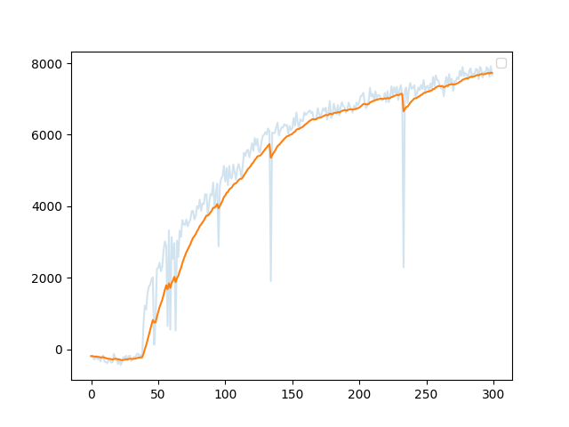

# MuJoCo with SAC

Soft Actor-Critic (SAC) implementation for continuous control tasks in MuJoCo environments via Gymnasium.

## Results

Training on `Humanoid-v5` for ~1800 episodes.



*X-axis: episode index. Y-axis: episode return. Light blue = raw returns per episode, orange = EMA smoothed.*

| Metric | Value |
|--------|-------|
| Best episode return | ~6300 |
| Smoothed return at end | ~5500 |
| Episodes trained | ~1800 |

## Features

- Twin Q-networks with target networks (soft Polyak updates)
- Squashed Gaussian policy with numerically stable log-prob
- Automatic entropy tuning (learned alpha)
- Checkpointing with auto-resume
- Best-model saving based on episode return

## Requirements

```
torch
gymnasium[mujoco]
stable-baselines3
```

## Files

| File | Purpose |
|------|---------|
| `config.py` | Hyperparameters and paths |
| `make_env.py` | Gymnasium vectorized env factory |
| `model.py` | `Actor` and `Critic` networks |
| `train.py` | Training loop (SAC + checkpointing) |
| `evaluate.py` | Load trained actor and run episodes |

## Usage

Train:

```bash
python train.py
```

Training auto-resumes from `checkpoints/latest.pth` if `resume = True`.

Evaluate:

```bash
python evaluate.py
```

## Configuration

Edit `config.py`:

| Parameter | Default | Notes |
|-----------|---------|-------|
| `env_id` | `Humanoid-v5` | Any continuous-action Gymnasium env |
| `total_timesteps` | `1_500_000` | Total env steps |
| `learning_rate` | `3e-4` | Shared by actor/critic/alpha |
| `buffer_size` | `1_000_000` | Replay buffer capacity |
| `gamma` | `0.99` | Discount factor |
| `tau` | `0.005` | Target network soft-update rate |
| `batch_size` | `256` | Minibatch size |
| `policy_update_period` | `1` | Actor update every N critic updates |
| `num_step_before_training` | `25000` | Random exploration warmup |
| `checkpoint_interval` | `50_000` | Steps between full checkpoints |
| `resume` | `True` | Auto-resume from `latest.pth` |

## Outputs

- `checkpoints/latest.pth` — full training state (actor, critics, targets, alpha, step, best return)
- `checkpoints/best.pth` — actor weights at highest-ever episode return
- `SAC.pth` — final actor weights after training finishes

## Algorithm

At each step after warmup:

1. Sample action from current policy, step env, store transition.
2. Sample minibatch, compute TD target with target critics minus entropy bonus.
3. Update both Q-networks (one combined backward pass).
4. Update actor against `min(Q1, Q2) - alpha * log_prob`.
5. Update `alpha` toward target entropy `-action_dim`.
6. Soft-update target networks: `theta_target <- (1 - tau) * theta_target + tau * theta_online`.
